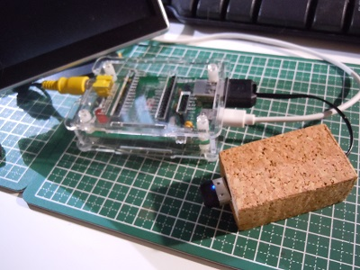
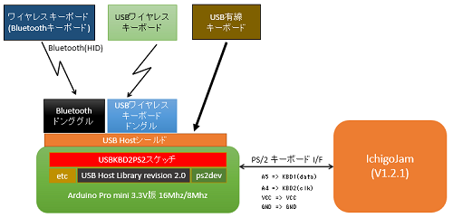
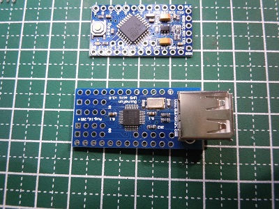
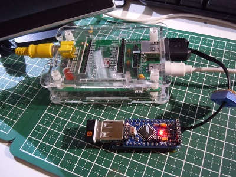
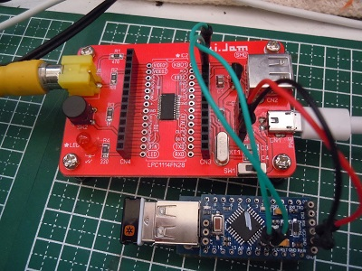
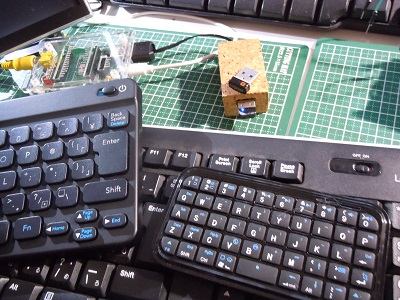

# Arduino_USBToPS2
Arduino USB・PS/2 変換モジュール  

  

## 概要  
Arduino pro mini 3.3V 8Mhz版＋USBホストシールドを使ったUSB・PS/2変換を行うモジュールです。  
本モジュールを使うことで、IchigoJamにてUSB HIDキーボード、bluetooth HIDキーボード(Bluetoothドングル利用時）、  
の利用が可能となります。  

## システム構成図  
   

### IchigoJamと本モジュールの接続  
#### IchigoJamのピンソケットに直接接続する場合  

Arduino pro mini|ichigojam
:--:|:--:|
RAW|5V  
GND|GND  
A4|KBD2 (PS/2 CLK)  
A5|KBD1 (PS/2 DATA)

#### IchigoJamのUSBコネクタに接続する場合  
Arduino pro mini|ichigojamのUSBコネクタ
:--:|:--:|
RAW|USB VBAS(5V)  
GND|USB GND  
A4|USB D+(PS/2 CLK)
A5|USB D-(PS/2 DATA)

## 必要パーツ  

   
 - Arduino pro mini 3.3V版 8MHz(写真上)  
 - Mimi USB Host Shield(写真下)  
 - 結線用パーツ（ブレッドボード、ジャンパワイヤ）  
  
 純正品は高いのでクローン製品を利用しています。  
 AliexpressではArduino pro mini 3.3V版が$2程度、Mimi USB Host Shieldが$8程度で購入出来ます。  

## 製作  
 - Mimi USB ホストシールドにシングルピンソケットを付けてArduino pro miniを乗せられるようにします。    
 - Arduino pro miniは、スケッチ書き込み、IchigoJamとの

### 接続例1  
IchigoJamのVCC、GND、KBD1、KBD2端子に接続  
   

### 接続例2  
IchigoJamのUSBコネクタに接続    
   

### 動作確認したキーボード  
   

## 関連記事  
・猫にコ・ン・バ・ン・ワ  - IchigoJam用 USBキーボード変換 Bluetooth・USBキーボードの両対応できました2016/11/19    
  http://nuneno.cocolog-nifty.com/blog/2016/11/ichigojam-usb-b.html  
・猫にコ・ン・バ・ン・ワ  - IchigoJamでLogicool製ワイヤレスキーボードを利用する(USB・PS/2変換) その2  
  http://nuneno.cocolog-nifty.com/blog/2016/11/ichigojamlogi-1.html  
・猫にコ・ン・バ・ン・ワ  - IchigoJamでLogicool製ワイヤレスキーボードを利用する(USB・PS/2変換)  
  http://nuneno.cocolog-nifty.com/blog/2016/11/ichigojamlogico.html  
・猫にコ・ン・バ・ン・ワ  - IchigoJamでポケモンキーボードを使ってみる(Bluetooth・PS/2変換)  
  http://nuneno.cocolog-nifty.com/blog/2016/11/ichigojam-f720.html  
・猫にコ・ン・バ・ン・ワ  - Arduino Pro mini Pro Mini用USB HOSTシールドの調査  
  http://nuneno.cocolog-nifty.com/blog/2016/11/arduino-pro-m-1.html  
