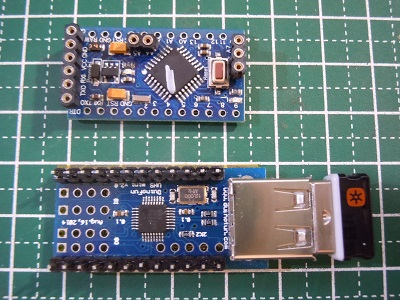
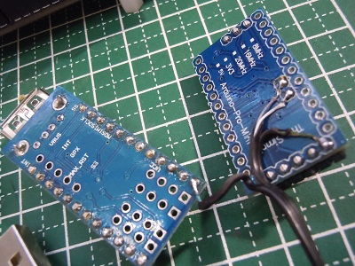

# Arduino_USBToPS2
Arduino pro mini利用 USB・PS/2 変換モジュール  

  

## 概要  
Arduino pro mini 3.3V 8Mhz版＋USBホストシールドを使ったUSB・PS/2変換を行うモジュールです。  
本モジュールを使うことで、IchigoJamにてUSB HIDキーボード、bluetooth HIDキーボード(Bluetoothドングル利用時）、  
の利用が可能となります。  
開発環境はArduino IDE 1.6.12を利用しました。  

## システム構成図  
   

本モジュールは、IchogoJamのPS/2インターフェース経由で接続して利用します。  
USB-Bluetoothドングル、ワイヤレスキーボード用ドングルを使ってワイヤレスキーボードの利用も可能です。  

### IchigoJamと本モジュールの接続  
#### 1)IchigoJamのピンソケットに直接接続する場合  

Arduino pro mini|ichigojam
:--:|:--:|
RAW|5V  
GND|GND  
A4|KBD2 (PS/2 CLK)  
A5|KBD1 (PS/2 DATA)

#### 2)IchigoJamのUSBコネクタに接続する場合  
Arduino pro mini|ichigojamのUSBコネクタ
:--:|:--:|
RAW|USB VBAS(5V)  
GND|USB GND  
A4|USB D+(PS/2 CLK)
A5|USB D-(PS/2 DATA)

## 必要パーツ  

   
- Arduino pro mini 3.3V版 8MHz(写真上)  
- Mimi USB Host Shield(写真下)  
- 結線用パーツ(ブレッドボード、ジャンパワイヤ)  

純正品は高いのでクローン製品を利用しています。  
AliexpressではArduino pro mini 3.3V版が$2程度、Mimi USB Host Shieldが$8程度で購入出来ます。  
ただし、クローン製品のMimi USB Host ShieldはUSBのVBASが5V供給が出来ず3.3V固定となりなす。  

## 製作  
Mimi USB Host ShieldにArduino pro miniを乗せて使います。  
脱着可能にする等、各自の用途に合わせて工夫して実装して下さい。  

**ポイント**
 - Mimi USB Host Shieldにシングルピンソケットを付けてArduino pro miniを乗せられるようにします。    
 - Arduino pro miniはスケッチ書き用の端子を確保：GND、VCC、TXD、RXD、DTR  
 - IchigoJamとの接続用の端子を確保： A4、A5 （※ スケッチの#defineにて他のピンに変更できます)  
 - USBコネクタにて接続する場合は、USBケーブルを接続します。  
 - Circuits@HomeのオリジナルMimi USB Host Shieldを利用する場合はUSB 5V供給が出来るようです。
   
    
    

### 接続例1  
IchigoJamのVCC、GND、KBD1、KBD2端子に接続  
   

### 接続例2  
IchigoJamのUSBコネクタに接続    
   

### スケッチ(ファームウェア)の書込み  
- スケッチ(ファームウェア)の書込みには、Arduino IDE 1.6.12を利用しました。  
- フォルダ USBKBD2PS2_v2を各自の開発環境に配置して下さい。  
- 書込みにはUSB-UARTモジュールが必要です。  
- スケッチのコンパイルには以下のライブラリが必要です.  
  - ps2dev(ps2dev.zip) - an interface library for ps2 host : http://playground.arduino.cc/ComponentLib/Ps2mouse  
  - USB_Host_Shield_2.0 (https://github.com/felis/USB_Host_Shield_2.0)  
  - MsTimer2 (http://playground.arduino.cc/Main/MsTimer2)  

### 利用方法  
- 本モジュール(キーボードも接続)をIchigoJamに接続後、IchigoJamの電源を入れて下さい。  
  IchigoJamはキーボードイニシャル処理を起動時のみしか行わないため、IchigoJamが起動した状態で  
  本モジュールを繋げても認識してくれません。  
- Bluetoothキーボードを利用する場合、起動後にbluetoothドングルのLEDが点滅していること確認の上、  
  キーボードを押し続けるとペアリングが行われます。  
- プラグ＆プレイに対応しています。有線キーボードを抜いて、 bluetoothドングルを使うことも可能です。  

### 制約事項    
- メディアキーは利用出来ません。 
- USBの供給電源が3.3Vのため、接続したキーボードが動作しない可能性があります。  
- Bluetoothキーボードはペアリングが正常に行えないものがあるようです(原因調査中）。  
- キーリピートがIchigoJamに直接接続して利用する場合より若干早いようです。  

### 動作確認したキーボード  
   
- Bluetoothドングル  
  -- Elecom LBT-UAN05C2  
  -- planex BT-MicroEDR2X  
- Bluetoothキーボード  
  -- ポケモンキーボード  
- USBキーボード  
  -- ロジクール WIRELESS KEYBOARD K275 (無線)  
  -- サンワサプライ SKB-KG3W (有線) 
  -- Elecom TK-FCM007BK (有線) 

## 関連記事  
・猫にコ・ン・バ・ン・ワ  - IchigoJam用 USBキーボード変換 Bluetooth・USBキーボードの両対応できました2016/11/19    
  http://nuneno.cocolog-nifty.com/blog/2016/11/ichigojam-usb-b.html  
・猫にコ・ン・バ・ン・ワ  - IchigoJamでLogicool製ワイヤレスキーボードを利用する(USB・PS/2変換) その2  
  http://nuneno.cocolog-nifty.com/blog/2016/11/ichigojamlogi-1.html  
・猫にコ・ン・バ・ン・ワ  - IchigoJamでLogicool製ワイヤレスキーボードを利用する(USB・PS/2変換)  
  http://nuneno.cocolog-nifty.com/blog/2016/11/ichigojamlogico.html  
・猫にコ・ン・バ・ン・ワ  - IchigoJamでポケモンキーボードを使ってみる(Bluetooth・PS/2変換)  
  http://nuneno.cocolog-nifty.com/blog/2016/11/ichigojam-f720.html  
・猫にコ・ン・バ・ン・ワ  - Arduino Pro mini Pro Mini用USB HOSTシールドの調査  
  http://nuneno.cocolog-nifty.com/blog/2016/11/arduino-pro-m-1.html  
